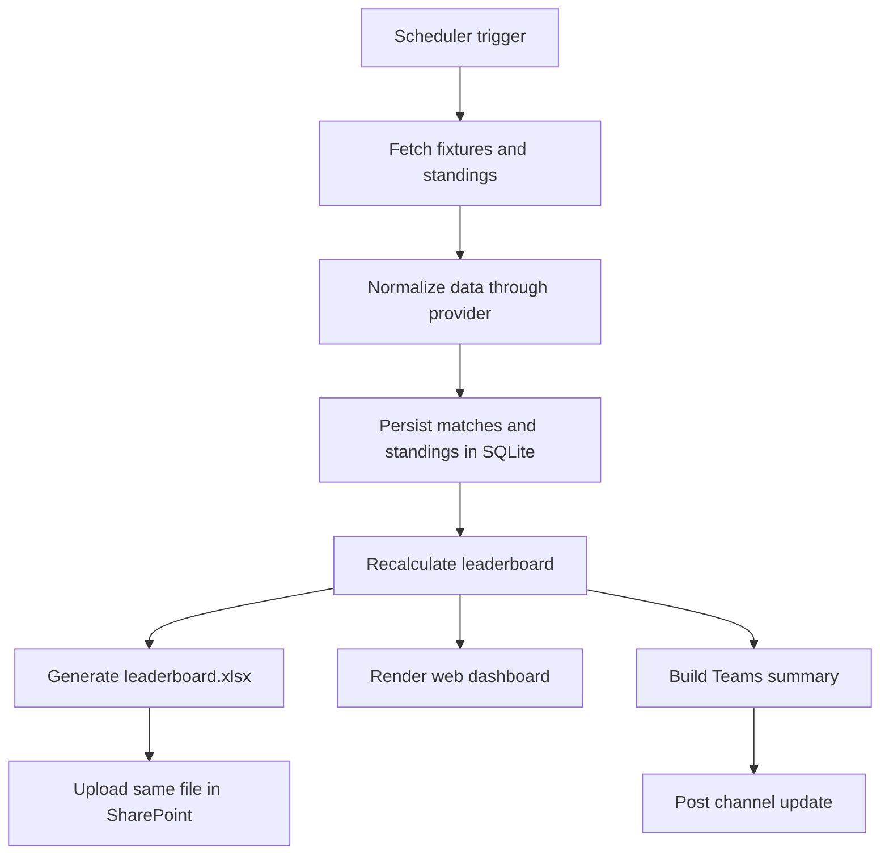

# World Cup Sweepstake

Python sweepstake tracker for a FIFA World Cup 2026 office pool, now with a live web UI and scoreboard-style workbook output.

## What it does

- Polls a football API on a 15-minute schedule.
- Tracks completed matches in SQLite.
- Rebuilds the leaderboard workbook from database state on every run.
- Serves a dark scoreboard-style dashboard based on the participant table layout.
- Replaces a single existing `leaderboard.xlsx` in SharePoint.
- Posts a match summary to Teams through a configurable notifier.

## Default stack

- Football API: `football-data.org`
- Database: SQLite
- Excel generation: `openpyxl`
- SharePoint upload: Microsoft Graph app-only client credentials
- Teams updates: incoming webhook by default, with notifier abstraction for tenant-specific alternatives

## Why this provider

I picked `football-data.org` as the default provider because its official coverage page includes `Worldcup` in the free tier, while API-Football's official pricing/docs say the free plan is limited to 100 requests per day and recent seasons. That makes `football-data.org` the safer starting point for a 15-minute unattended job.

## Repository layout

```text
config/
  participants.csv
  settings.yaml
data/
  sweepstake.db
output/
  leaderboard.xlsx
src/
  api_client.py
  configuration.py
  database.py
  leaderboard.py
  main.py
  models.py
  presentation.py
  scheduler.py
  sharepoint.py
  team_codes.py
  teams.py
  web.py
static/
templates/
tests/
```

## Architecture



## Important Microsoft note

For unattended file replacement, app-only Graph auth is the right approach.

For normal live Teams channel posts, Microsoft Graph does not support app-only posting for standard create-message flows. Because of that, this project keeps Teams notifications behind a notifier abstraction. Start with an incoming webhook if your workplace allows it; otherwise we can swap in a tenant-approved path later.

## Setup

1. Create a virtual environment.
2. Install dependencies:

```bash
pip install -r requirements.txt
```

3. Update `config/participants.csv` if the participant/team roster changes.
4. Set these environment variables:

```bash
export FOOTBALL_DATA_API_KEY=...
export MS_TENANT_ID=...
export MS_CLIENT_ID=...
export MS_CLIENT_SECRET=...
export MS_SITE_ID=...
export MS_DRIVE_ID=...
export MS_LEADERBOARD_ITEM_ID=...
# or
export MS_LEADERBOARD_PATH=Shared Documents/General/leaderboard.xlsx

# optional if using webhook notifier
export TEAMS_WEBHOOK_URL=...
```

5. Adjust `config/settings.yaml` if needed.

## Local usage

Initialize the database:

```bash
python -m src.main init-db
```

Sync participant CSV into SQLite:

```bash
python -m src.main sync-participants
```

Run the job once:

```bash
python -m src.main run-once
```

Serve the local UI:

```bash
python -m src.main serve
```

Then open <http://localhost:8000>.

## Deployment options

### GitHub Actions

The repo includes [`.github/workflows/sweepstake.yml`](.github/workflows/sweepstake.yml) for a 15-minute scheduled run. Put all required secrets into the repository settings.

### Docker

Build:

```bash
docker build -t world-cup-sweepstake .
```

Run:

```bash
docker run --rm --env-file .env -v "$PWD/config:/app/config" -v "$PWD/data:/app/data" -v "$PWD/output:/app/output" world-cup-sweepstake
```

If you want a host cron instead of GitHub Actions, run the container on a 15-minute cron schedule.

### Docker with in-container cron

Build:

```bash
docker build -f Dockerfile.cron -t world-cup-sweepstake-cron .
```

Run:

```bash
docker run -d --name world-cup-sweepstake-cron --env-file .env -v "$PWD/config:/app/config" -v "$PWD/data:/app/data" -v "$PWD/output:/app/output" world-cup-sweepstake-cron
```

## Testing

```bash
pytest
```

## Operational notes

- Runs are idempotent at the match level through the `matches` table and `posted_to_teams` flag.
- The workbook is always regenerated from SQLite rather than edited in place.
- The dashboard and workbook intentionally follow the same dark/gold scoreboard visual language.
- Participant team names can be entered as common country names like `USA` and are normalized to stable codes where possible.
- `alive` currently relies on provider qualification signals when available. If your chosen upstream exposes richer knockout progression flags, we can tighten that logic further.
