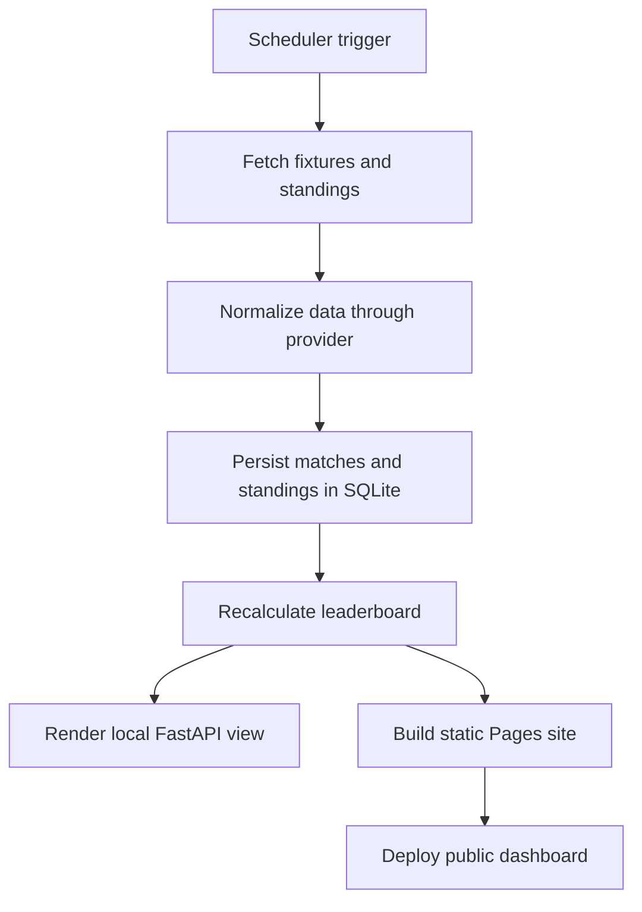

# World Cup Sweepstake

Python sweepstake tracker for a FIFA World Cup 2026 office pool, with a two-page dashboard that publishes safely to GitHub Pages.

## What it does

- Polls a football API on a 15-minute schedule.
- Tracks completed matches in SQLite.
- Rebuilds the participant leaderboard from current tournament standings.
- Builds a two-page static site with `Insights` and `Leaderboard`.
- Exports a combined GitHub Pages bundle where production stays on `main` and sandbox lives under `/dev/`.

## Default stack

- Football API: `football-data.org`
- Database: SQLite
- Local preview: FastAPI
- Static deployment: GitHub Pages via GitHub Actions

## Why this provider

I picked `football-data.org` as the default provider because its official coverage page includes `Worldcup` in the free tier, while API-Football's official pricing/docs say the free plan is limited to 100 requests per day and recent seasons. That makes `football-data.org` the safer starting point for a 15-minute unattended job.

## Repository layout

```text
config/
  participants.csv
  settings.yaml
data/
  sweepstake.db
output/
  leaderboard.xlsx
site/
  index.html
  static/
src/
  api_client.py
  configuration.py
  database.py
  leaderboard.py
  main.py
  models.py
  presentation.py
  scheduler.py
  site.py
  sharepoint.py
  team_codes.py
  teams.py
  web.py
static/
templates/
tests/
```

## Architecture



## Setup

1. Create a virtual environment.
2. Install dependencies:

```bash
pip install -r requirements.txt
```

3. Update `config/participants.csv` if the participant/team roster changes.
4. Set these environment variables:

```bash
export FOOTBALL_DATA_API_KEY=...
```

5. Adjust `config/settings.yaml` if needed.

## Local usage

Initialize the database:

```bash
python -m src.main init-db
```

Sync participant CSV into SQLite:

```bash
python -m src.main sync-participants
```

Run the job once:

```bash
python -m src.main run-once
```

Build the static site bundle:

```bash
python -m src.main build-site
```

Serve the local UI:

```bash
python -m src.main serve
```

Then open <http://localhost:8000>.

## Deployment options

### GitHub Actions / GitHub Pages

The repo includes [`.github/workflows/pages.yml`](.github/workflows/pages.yml) for push, manual, and 15-minute scheduled deployments.

Deploy model:

- `main` builds the production site at `/`
- `dev` builds the sandbox site at `/dev/`
- Every Pages deployment publishes a combined artifact, so a `dev` deploy does not overwrite production

Required secrets:

- `FOOTBALL_DATA_API_KEY`
- `THE_ODDS_API_KEY` only if you enable the optional odds provider in `config/settings.yaml`

Enable GitHub Pages in the repo settings with `GitHub Actions` as the source.

### Sandbox testing

- Push V2 work to the existing `dev` branch.
- Open the sandbox at `/dev/` on the GitHub Pages site.
- Production remains available at the root URL from `main`.

### Merging V2 to production

1. Finish and validate V2 on `dev`.
2. Confirm the sandbox URL under `/dev/` looks correct.
3. Merge `dev` into `main`.
4. Let the Pages workflow republish the combined bundle so the root URL updates to the approved version.

### Docker

Build:

```bash
docker build -t world-cup-sweepstake .
```

Run:

```bash
docker run --rm --env-file .env -v "$PWD/config:/app/config" -v "$PWD/data:/app/data" -v "$PWD/output:/app/output" world-cup-sweepstake
```

If you want a host cron instead of GitHub Actions, run the container on a 15-minute cron schedule.

### Docker with in-container cron

Build:

```bash
docker build -f Dockerfile.cron -t world-cup-sweepstake-cron .
```

Run:

```bash
docker run -d --name world-cup-sweepstake-cron --env-file .env -v "$PWD/config:/app/config" -v "$PWD/data:/app/data" -v "$PWD/output:/app/output" world-cup-sweepstake-cron
```

## Testing

```bash
pytest
```

## Operational notes

- Runs are idempotent at the match level through the `matches` table and `posted_to_teams` flag.
- The dashboard can be previewed locally with FastAPI or published as a static site.
- Daily message files are generated at `outputs/daily_messages/YYYY-MM-DD.txt` only once per weekday during the 07:00 UK refresh window.
- The workbook output is still available locally, but the live hosted path is the GitHub Pages dashboard.
- Participant team names can be entered as common country names like `USA` and are normalized to stable codes where possible.
- Tournament winner odds use an abstraction layer and stay hidden unless a real provider returns data.
